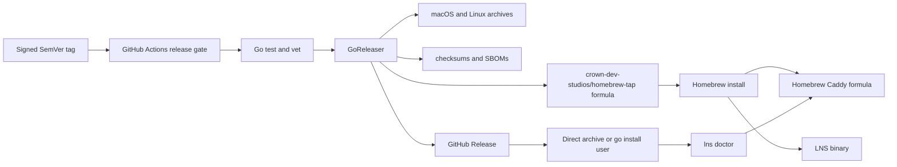
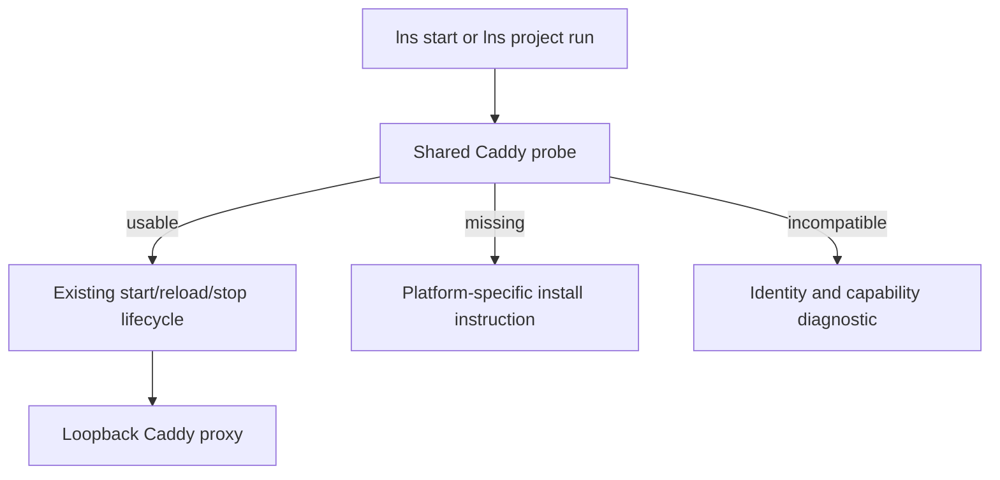

# Release and Distribution Workflow

## Current State & What Exists

LNS is ready to be built locally, but it is not yet shaped as an installable public Go command or an automated release:

- `go.mod:1` uses the local module name `lns`, so `go install github.com/crown-dev-studios/lns/cmd/lns@latest` is not a valid public installation path.
- `go.mod:18-22` contains three local `replace` directives. Version-qualified `go install` rejects modules whose `go.mod` changes dependency meaning this way.
- `cmd/lns/main.go:17` hard-codes `0.3.0`, while `Makefile:1-4` separately derives a version from Git. There are two competing version sources.
- `Makefile:30-43` cross-builds raw binaries manually, including Windows, but the project does not yet have a supported Windows runtime contract.
- `Makefile:89-96` can create binaries and checksums locally, but does not publish immutable artifacts or release metadata.
- `cmd/lns/main.go:63-65` fails clearly when Caddy is absent.
- `cmd/lns/main.go:115-140` already provides `lns doctor`, but only checks whether a `caddy` executable exists; it does not prove that the executable is a usable Caddy v2 build.
- `cmd/lns/util.go:15-45` owns the current Caddy start/elevation behavior. Distribution must not silently introduce a second Caddy lifecycle.
- `internal/caddy/caddy_test.go:38-49` already uses `caddy adapt` as a capability check when Caddy is installed.
- `README.md:20-35` documents a contributor-style local Go install plus a separate Caddy install. It does not yet present an end-user release channel.
- `LICENSE:1-21` provides an MIT license suitable for public distribution.

The repository has no release tags, GoReleaser configuration, GitHub Actions release workflow, or Homebrew tap definition yet.

## Constraints

- LNS is a Go CLI, but Caddy is a separate executable that LNS starts, reloads, and stops.
- Stable local names require a Caddy v2 command with the CLI operations LNS uses: `start`, `reload`, `stop`, and `adapt`.
- Homebrew can manage Caddy as a declared dependency. `go install` and direct archive downloads cannot install external executables.
- The release workflow renders a small binary formula from a checked-in template instead of relying on GoReleaser's deprecated formula generator.
- The Homebrew package installs the checksummed GoReleaser archive for the host platform. It does not need Go, Apple signing credentials, or a quarantine bypass.
- A Homebrew tap update needs a separate repository credential; the default GitHub Actions token cannot write to another repository.
- Releases must be immutable and derived from SemVer tags.
- The first public release is `v0.1.0`; the binary reports `0.1.0` without the tag prefix.
- macOS and Linux are the supported initial release targets. Windows artifacts remain excluded until Windows process supervision and proxy behavior have an explicit support contract.
- Existing development, Docker, staging, and production configuration remain outside the release system and must not be mutated by installation.

## Invariants

- LNS owns LNS; Caddy remains an independently versioned dependency.
- Installing or upgrading LNS must not start Caddy, create routes, edit repositories, or alter Docker configuration.
- Homebrew installation installs a compatible Caddy dependency automatically.
- Non-Homebrew installation reports a missing or unusable Caddy before a project run begins and gives an exact remediation.
- The Git tag is the single release version source.
- A release contains the same LNS executable behavior regardless of installation channel.
- Every published archive has a checksum; every published binary reports its tag, commit, and build date.
- A failed build, test, artifact verification, or tap update cannot be presented as a successful release.
- LNS continues to work as an opt-in developer tool. No consumer repository needs an LNS config file or committed integration.

## Non-Goals

- Embedding the Caddy Go modules into the LNS process.
- Silently downloading or updating Caddy when `lns` runs.
- Managing Caddy as a Homebrew service; LNS keeps its existing process lifecycle.
- Publishing to `homebrew/core` in the first release.
- Shipping apt, rpm, snap, Windows, or container packages in the first release.
- Adding an LNS self-update command.
- Signing and notarizing Caddy itself; Homebrew or the user's platform package manager owns its Caddy artifact.

## Options Considered

### Option A: Separate Caddy dependency, Homebrew-managed where available

Publish LNS archives and a Homebrew formula that installs those precompiled archives. Declare the existing Homebrew `caddy` formula as its runtime dependency. Keep `lns doctor` as the dependency boundary for `go install` and direct downloads.

This produces the lowest-friction Homebrew path without making LNS responsible for Caddy security releases. It also preserves a clear boundary for Linux and Go users.

### Option B: Bundle the Caddy binary in every LNS archive

Publish an LNS archive containing both executables and teach LNS to locate the adjacent Caddy binary.

This creates a single download, and Caddy's Apache-2.0 license permits redistribution when its notices are preserved. It also doubles the release matrix, increases artifact size, duplicates an executable the user may already have, makes every Caddy security release an urgent LNS release, and creates ambiguity over whether PATH Caddy or bundled Caddy is authoritative.

### Option C: Embed Caddy as a Go dependency

Compile Caddy into LNS and run its server in process.

This creates one executable but collapses lifecycle and failure boundaries, substantially increases build complexity and binary size, and still does not remove privileged-port concerns. It would turn LNS into a Caddy distribution rather than a small coordinator.

### Selected: Option A

Keep Caddy separate. Homebrew installs it for the user; other channels check it and explain what is missing. This is the simplest durable ownership model and follows package-manager dependency behavior instead of recreating a package manager inside LNS.

## Canonical Architecture Direction

Use GitHub tags as the release source of truth, GoReleaser as the artifact builder/publisher, GitHub Releases as the canonical artifact store, and `crown-dev-studios/homebrew-tap` as the macOS installation channel.

The Homebrew package should be a generated formula that selects the tagged LNS archive for the host OS and architecture, pins its SHA-256, installs the included binary, and declares `caddy` as a formula dependency. Direct archives and `go install` remain supported secondary channels; those users satisfy the Caddy dependency themselves and verify it with `lns doctor`.

Do not bundle Caddy in the default artifact. If later evidence shows strong demand for a single offline archive, treat that as a separately named distribution with its own provenance and update policy rather than changing the meaning of the normal `lns` archive.

## Model & API Boundaries

### Release identity

One build metadata boundary should provide:

- `version`: SemVer tag, with `dev` as the local-build fallback.
- `commit`: full or unambiguous shortened Git commit.
- `buildDate`: UTC build timestamp.

`lns version` remains the public command and should report these fields in a stable, script-readable text form. The tag, not a checked-in Go constant, supplies release versions.

### Runtime dependency contract

Create one internal Caddy probe used by both startup and `lns doctor`. Its result should distinguish:

- executable not found;
- executable cannot run;
- executable is not a compatible Caddy v2 CLI;
- executable is usable;
- proxy admin endpoint is already occupied or reachable.

Prefer capability checks over an arbitrary minimum version: run `caddy version` for identity and validate generated configuration with `caddy adapt`. Keep installation advice at the CLI presentation layer so the probe remains platform-neutral.

Docker remains optional. A missing Docker executable stays a warning unless the selected project plan requires Compose dependencies.

### Release configuration boundary

- `.goreleaser.yaml` defines supported operating systems, architectures, archive names, checksums, SBOMs, release notes, and build metadata.
- `packaging/homebrew/lns.rb.tmpl` and `scripts/render-homebrew-formula.sh` define the precompiled-archive Homebrew package.
- `.github/workflows/ci.yml` proves ordinary commits.
- `.github/workflows/release.yml` publishes only tagged, already-verified commits.
- The separate `homebrew-tap` repository contains the generated formula; application source and its formula template remain in this repository.
- `README.md` documents installation channels and dependency behavior, not release implementation details.

## Architecture

## Error Handling & Observability

- CI and release jobs fail fast on formatting drift, tests, vet, GoReleaser configuration validation, or artifact smoke-test failure.
- A release job writes a GitHub job summary listing the tag and published artifacts.
- Release logs show the exact Go and GoReleaser versions used.
- `lns doctor` prints the resolved Caddy path and reported version on success.
- Dependency failures state what was attempted and give an OS-appropriate install command or official Caddy installation URL.
- `lns start` reuses the same probe and error vocabulary as `lns doctor`; it must not have a second, drifting dependency check.
- Homebrew tap publication failure makes the release workflow fail or marks the release incomplete; it is not reduced to an ignorable warning.
- Release artifacts include checksums and SBOMs so humans and agents can verify exactly what was shipped.

## Phases

### Phase 1: Make the Go module publishable

- Change the module path to `github.com/crown-dev-studios/lns` and update all internal imports.
- Remove the local `replace` directives and the now-unneeded `internal/third_party` modules after confirming upstream dependencies resolve normally.
- Run `go mod tidy`, all tests, and vet.
- Change the checked-in version fallback from `0.3.0` to `dev`; add commit and build-date fields behind the same command boundary.
- Verify a clean external module cache can build the command without local filesystem dependencies.

### Phase 2: Establish continuous integration

- Add a GitHub Actions CI workflow for supported Go versions on macOS and Linux.
- Run formatting verification, `go test ./...`, `go vet ./...`, and a normal command build.
- Cache only Go's module and build caches; do not cache repository-generated state.
- Make CI required before tagging a release.

### Phase 3: Strengthen the Caddy dependency check

- Extract the duplicated Caddy lookup into one internal probe.
- Use that probe from `lns doctor`, `lns start`, run-time reload, and stop paths where applicable.
- Report executable path and version, and use the existing `caddy adapt` behavior to prove the generated configuration is understood.
- Unit-test missing, non-executable, incompatible-output, and successful probe cases with fake executables.
- Keep Linux port-80 capability/elevation guidance separate from the Caddy installation check.

### Phase 4: Define deterministic release artifacts

- Add a pinned GoReleaser v2 configuration for `darwin/amd64`, `darwin/arm64`, `linux/amd64`, and `linux/arm64`.
- Exclude Windows until it has an explicit support gate.
- Produce versioned `tar.gz` archives, a checksum file, SBOMs, and changelog-derived release notes.
- Inject tag, commit, and UTC build date through linker flags.
- Add a snapshot command for maintainers and smoke-test every built binary with `lns version` and `lns plan` against a fixture.
- Validate the configuration with the pinned GoReleaser version in CI.

### Phase 5: Publish tagged GitHub releases

- Add a tag-triggered release workflow with minimal `contents: write` permission and provenance permission only if attestations are enabled.
- Re-run the full verification gate before publication rather than trusting an earlier workflow run by name.
- Require a clean `vMAJOR.MINOR.PATCH` tag that matches GoReleaser's parsed version.
- Use `v0.1.0` for the first public release rather than carrying forward the current hard-coded `0.3.0` development value.
- Publish artifacts to GitHub Releases and verify their checksums in a fresh job.
- Document an explicit first-release checklist and a recovery process that creates a new patch tag instead of replacing published artifacts.

### Phase 6: Add the Homebrew tap

- Create `crown-dev-studios/homebrew-tap` as a separate public repository.
- Render a formula from a checked-in template, pin every supported release archive checksum, and declare the `caddy` formula dependency.
- Use a narrowly scoped GitHub token stored as an Actions secret for tap updates.
- Add a release-side validation job that installs and tests the published formula on a clean macOS runner.
- Verify a clean machine can install LNS and Caddy through one Homebrew command, run `lns version`, and pass the Caddy portion of `lns doctor`.
- Publish only stable tags to the tap; release candidates remain GitHub prereleases.

### Phase 7: Replace contributor-only installation docs

- Make Homebrew the recommended macOS path.
- Document GitHub archives and public `go install` as secondary paths.
- State plainly that Homebrew installs Caddy, while other paths require a separate Caddy install.
- Keep source-build instructions in the development section.
- Add release-maintainer instructions for snapshot, tag, verification, and rollback-by-new-version.

## Acceptance Criteria

- [ ] `go install github.com/crown-dev-studios/lns/cmd/lns@<tag>` works from outside the repository with a clean module cache.
- [x] The repository has no local `replace` directive required for a release build.
- [x] `lns version` reports the release tag, commit, and build date; local builds report `dev` without pretending to be a release.
- [ ] The first public tag is `v0.1.0`, and `lns version` reports `0.1.0` for that build.
- [x] The tag workflow requires the same supported macOS/Linux and Go-version verification matrix as CI before publication.
- [ ] A SemVer tag publishes macOS and Linux amd64/arm64 artifacts, checksums, SBOMs, and release notes.
- [x] No Windows artifact is published until Windows is explicitly supported.
- [ ] `brew install crown-dev-studios/tap/lns` installs the matching precompiled LNS archive and the Homebrew Caddy dependency on a clean macOS runner without installing Go.
- [ ] The Homebrew installation does not start Caddy or modify a project repository.
- [x] `lns doctor` distinguishes missing, broken/incompatible, timed-out, and usable Caddy installations and prints actionable remediation.
- [x] Direct archive and `go install` users get a clear Caddy installation message before LNS attempts Docker or other project work.
- [ ] Published checksums verify in an independent post-publish job.
- [x] The README no longer tells end users to install from a development checkout.

Repository implementation is complete. The unchecked criteria are release-activation checks that require the first immutable tag and configured tap credential; they cannot be truthfully completed on an untagged feature branch.

## Verification

- Run `gofmt` verification, `go test ./...`, `go vet ./...`, and a clean `go build ./cmd/lns` on macOS and Linux CI runners.
- Run `goreleaser check` and `goreleaser release --snapshot --clean` with the pinned release-tool version.
- Extract every snapshot archive into an empty temporary directory and run its binary's `version` command.
- From an empty temporary module context and clean Go caches, install the tagged public command and run `lns version`.
- In a clean macOS runner, install the formula from the tap, assert `brew list --formula caddy`, run the formula test, and run `lns doctor`.
- Test `lns doctor` against fake PATH entries for no Caddy, a failing executable, non-Caddy output, and a compatible Caddy CLI.
- Verify the Homebrew package performs no service start and creates no `~/.lns` state during installation.
- Download the published artifacts in a separate job and verify them against the published checksum file.
- Perform the first real release as a prerelease candidate, complete the install matrix, then create the stable tag rather than mutating the candidate artifacts.

## Review Lenses

- [x] **DRY.** One Caddy probe and one release metadata source replace duplicated checks and versions.
- [x] **Service and API boundaries.** LNS coordinates Caddy; Homebrew installs it; GoReleaser publishes LNS. No layer takes ownership of another layer's update lifecycle.
- [x] **Concurrency safety.** Release publication is one tag-triggered job with concurrency keyed by tag; runtime locking behavior is unchanged.
- [x] **Performance gaps.** Dependency probes are local subprocess checks performed at command boundaries, not repeated in service discovery loops.
- [x] **Pattern conformity.** Cobra commands and existing Caddy lifecycle code are extended rather than replaced.
- [x] **Type safety.** The Caddy probe has a typed result rather than passing loosely related strings and errors between commands.
- [x] **Testing philosophy.** Pure probe logic gets unit coverage; packaging and installation behavior is proven at real process boundaries.
- [x] **Error handling and observability.** Dependency state, release identity, artifacts, and tap publication are visible in CLI output and CI summaries.

## Deferred Work

- **Must do now** — public module path, removal of release-blocking replacements, one version source, CI, Caddy probe, macOS/Linux artifacts, checksums, Homebrew dependency, and installation documentation.
- **Good follow-up** — submission to `homebrew/core`, Linux packages, shell completions, and a separately evaluated offline bundle.
- **Not worth doing** — runtime auto-download of Caddy, silently stripping macOS quarantine metadata, embedding Caddy into LNS, or publishing Windows merely because Go can cross-compile it.
